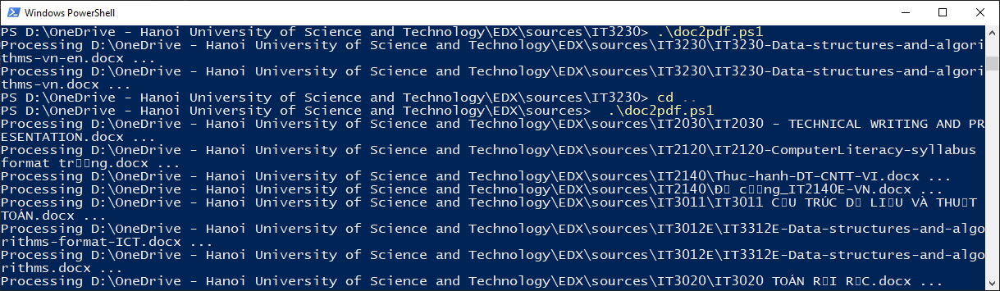

# doc2pdf
Convert all .doc|docx|xlsx files in a directory and its sub to pdf. Store pdf at the same location.

# Usages:

```powershell
doc2pdf.ps1 [[-NameCondition] <string>] [[-Folder] <string>] [<CommonParameters>]
ppt2pdf.ps1 [[-NameCondition] <string>] [[-Folder] <string>] [<CommonParameters>]
xlsx2pdf.ps1 [[-NameCondition] <string>] [[-Folder] <string>] [<CommonParameters>]
```
For examples:

```powershell
doc2pdf.ps1 -NameCondition chapter_  -Folder "C:\Users\Public"
```

  

# Note
ps1 is the executable file, so it'll be blocked after downloading from internet. Unblock it to run like the image below.

  


# Thanks
Adapted from https://gist.github.com/allenyllee/5d7c4a16ae0e33375e4a6d25acaeeda2
Thank to mp4096, the author of the script ppt2pdf which I customized to this script

and from mp4096
  "Adapted from http://stackoverflow.com/questions/16534292/basic-powershell-batch-convert-word-docx-to-pdf
   Thanks to MFT, takabanana, ComFreek"

# xlsx2pdf
convert all excel sheets to pdf
NOTE: Change 2 parameters below to force the begin and end page indexes.
    $From = [System.Type]::Missing
    $To = 3
